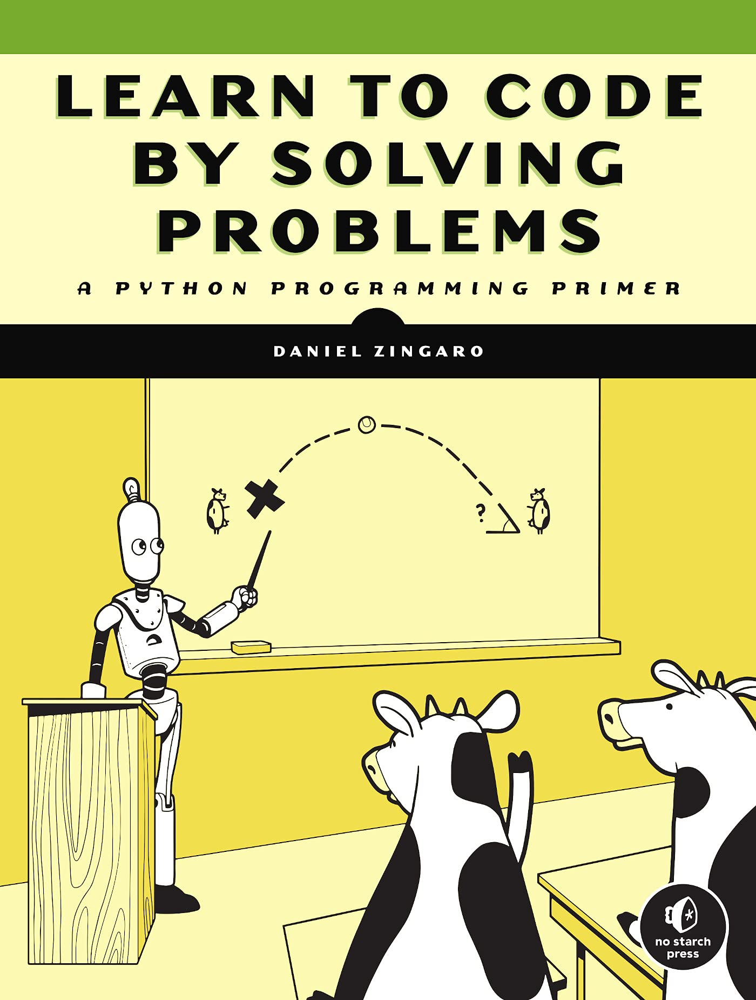

# Learn to Code by Solving Problems(LTCBSP)

## About
- Title: Learn to Code by Solving Problems: A Python Programing Primer
- Author: Daniel Zingaro
- ISBN 978-1-7185-0132-4
- Pre-requisites: None

This book is an introduction to Python programming with the use of programming problems. It uses questions from past coding competitions (jams). This repo contains the code I have written in order to solve those problems, separated by Chapter.

### From the Back of the book
>Every Chapter presents problems from coding challenge websites, where online judges test your solutions and provide targeted feedback. As you practice using core Python features, functions and techniques, you'll develop a clear understanding of data structures, algorithms and other programming basics.
You'll learn how to:
>>- Run Python code, work with strings and use variables
>>- Write Programs that make decisions
>>- Make code more efficient with while and for loops
>>- Use PYthon sets, lists and dictionaries to organize sort and research data
>>- Design programs using functions and top-down design
>>- Create complete search algorithims and use Big O notation to design more efficient code

## Chapters
1. Introduction: Getting Started
2. Making Decisions: Introduction to IF/Else
3. Repeating Code: Introduction to For Loops
4. Repeating Code: Introduction to While Loops
5. Organizing Values Using Lists